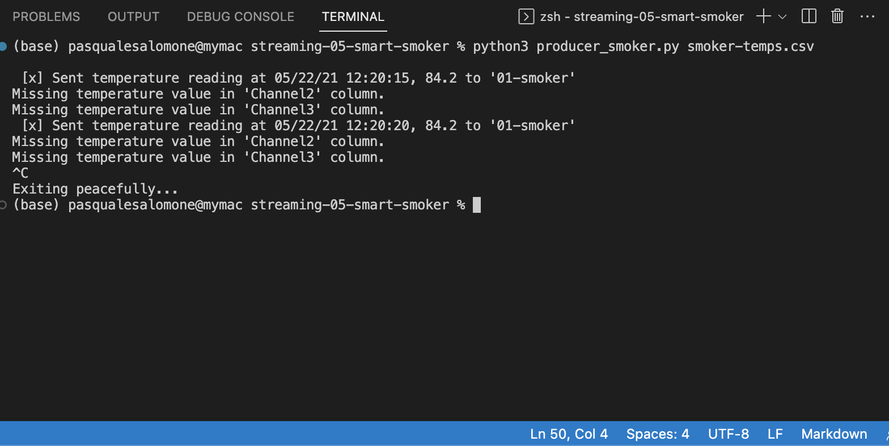

# Project Title: streaming-05-smart-smoker
- Author: Pasquale Salomone
- Date: September 12, 2023

This application of RabbitMQ reads temperature data from a CSV file and sends it to RabbitMQ queues. It also opens the RabbitMQ Admin website for monitoring.
The CSV file contains temperature readings for a smoker and two foods.

## Prerequisites

1. Git
1. Python 3.7+ (3.11+ preferred)
1. VS Code Editor
1. VS Code Extension: Python (by Microsoft)

The following modules are required: 


| Module          | Version  |
|-----------------|----------|
| csv             | 1.0      |
| webbrowser      | 3.11.4   |
| sys             | 3.11.4   |
| time            | 3.11.4   |
| pika            | 1.3.2    |


## Notes

I did not implement the logging functionality for this producer. I also implemented a try and except block to handle cases where there was either missing data or the CSV has no data.
```
try:
                        temperature_str = row.get(channel_name, '')
                        if temperature_str:
                            temperature = float(temperature_str)
                            send_temperature_to_queue(temperature, queue_name)
                            data_found = True
                        else:
                            print(f"Missing temperature value in '{channel_name}' column.")
                    except ValueError:
                        print(f"Invalid temperature value in '{channel_name}' column.")
                    except KeyError:
                        print(f"Invalid column name: '{channel_name}'")

                time.sleep(sleep_interval)
            
            if not data_found:
                print("No valid data was found in the CSV file.")
```

## Terminals Screenshots

See a running example with at least 3 concurrent process windows here:




## Suggested Readings

1. Read the [RabbitMQ Tutorial - Work Queues](https://www.rabbitmq.com/tutorials/tutorial-two-python.html)
1. Read the code and comments in this repo.


- [RabbitMQ Tutorial - Work Queues](https://www.rabbitmq.com/tutorials/tutorial-two-python.html)


## Acknowledgments

I would like to acknowledge both Stackoverflow and ChatGPT as an instrumental aid in the development of this project.
